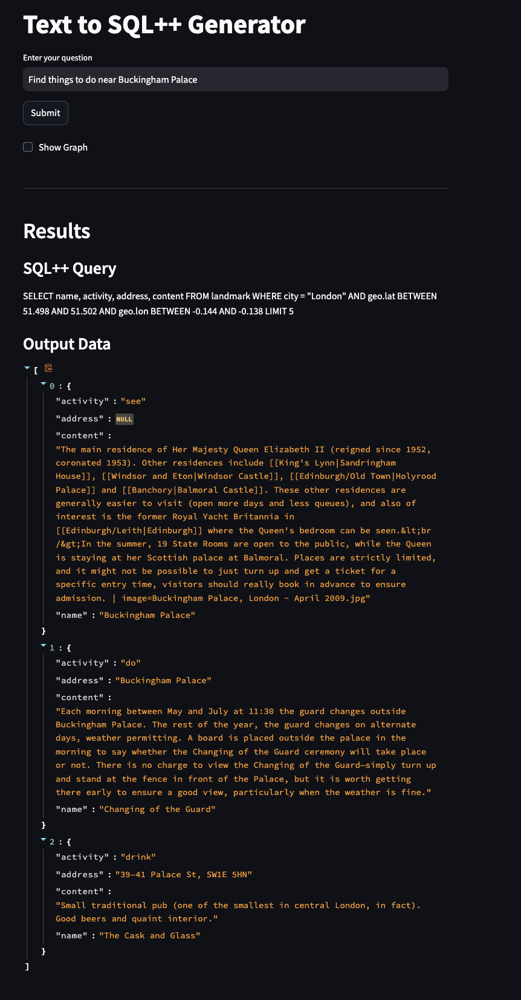
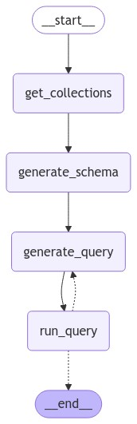

## SQL++ Query Generation using Agents



## Agent Demo using Couchbase, Streamlit, LangGraph, and OpenAI

This is a demo app using agents built to generate and run SQL++ queries for Couchbase to answer users' natural language questions.

This demo was part of the [PyCon Portugal 2024 talk](https://2024.pycon.pt/talks/schedule/).

### How does it work?

The agent follows a workflow as shown below:



### How to Run

- #### Install dependencies

  `pip install -r requirements.txt`

- #### Set the environment secrets

  Copy the `.env.example` file in the folder and rename it to `.env` and replace the placeholders with the actual values for your environment

  ```
  OPENAI_API_KEY=<openai_api_key>
  CB_CONNECTION_STRING=<connection_string_for_couchbase_cluster>
  CB_BUCKET_NAME=<bucket_name>
  CB_USERNAME=<database_username>
  CB_PASSWORD=<database_password>
  CB_SCOPE_NAME=<scope_name>
  LANGSMITH_API_KEY=<langsmith_api_key>
  LANGCHAIN_ENDPOINT="https://api.smith.langchain.com"
  ```

- #### Run the application

  `streamlit run demo.py`
